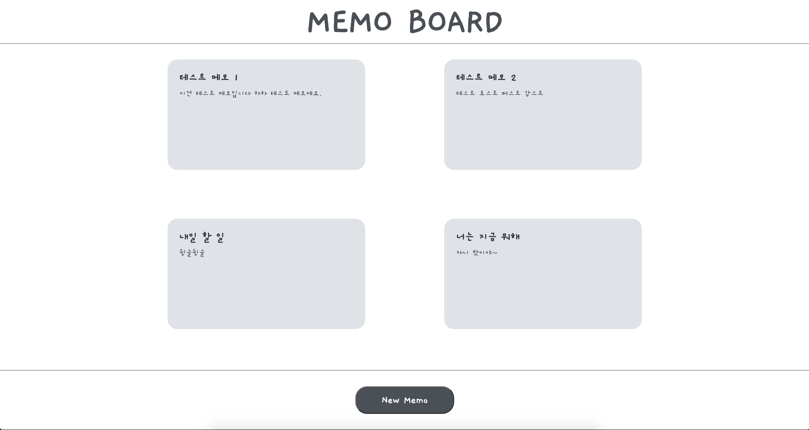
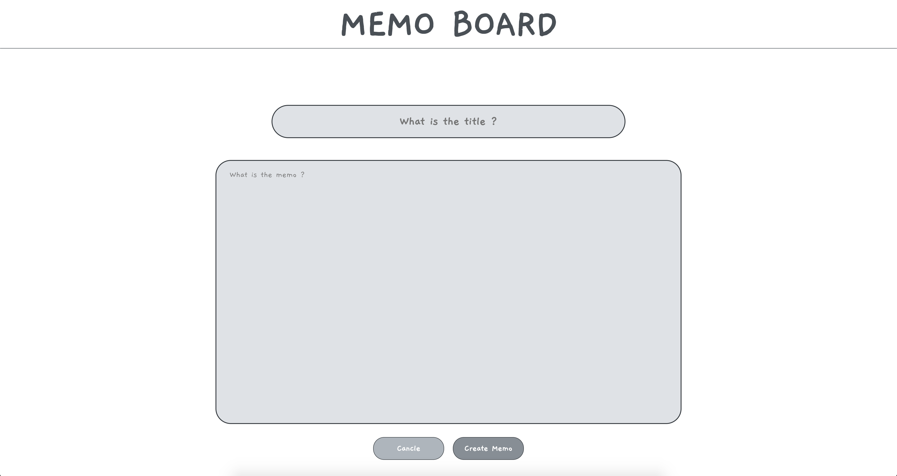

# Memo Board

<hr>

**기능 설명**

```
1.  메모를 작성하면 localStorage에 저장됩니다.
2.  메인 페이지에서 메모를 확인할 수 있습니다.
3.  메모를 삭제할 수 있습니다.
```

**사용 스택**

```
 - React.js
 - styled-components
```

**화면**

1. 메인 화면
   

2. 작성 화면
   
